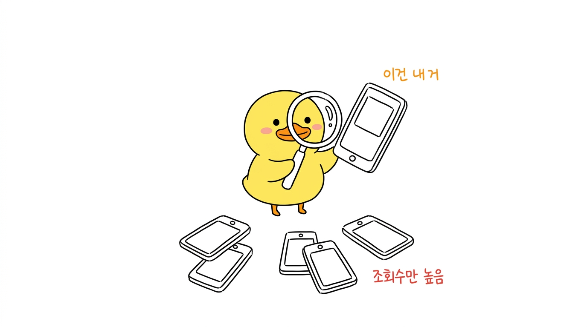

# HypeDuck Illustrations

글·대본·개념을 **흰 배경 손그림 오리 일러스트**로 만드는 프롬프트 팩.
블로그·유튜브·스레드 본문 삽화, PPT용 낱장 이미지에 쓴다.



- 순백 배경 · 검정 세선 손그림 · 여백 35%+
- **오리만 컬러** (노랑 `#FFD400` 몸 + 주황 `#FF8A00` 부리, 레퍼런스 얼굴 고정)
- 한국어 손글씨 주석 (빨강=경고/결과, 주황=흐름, 파랑=상태)
- 장당 메시지 1개 · 16:9

**설치도 API 키도 필요 없다.** 프롬프트 정본이 [PROMPT.md](skills/hypeduck-illustrations/PROMPT.md)에 있고,
이미지 생성이 되는 AI면 뭐든(ChatGPT·Claude·Gemini·Midjourney 등) 붙여넣어 쓰면 된다.

---

## ChatGPT에서 쓰기 (가장 쉬움)

1. [PROMPT.md](skills/hypeduck-illustrations/PROMPT.md)의 **DNA 블록**을 복사해서 붙여넣는다.
2. [마스코트 이미지](skills/hypeduck-illustrations/assets/hypeduck-logo.png)를 같이 **첨부**한다 (얼굴을 매번 똑같이 유지하는 핵심).
3. 그리려는 장면을 5칸으로 적는다 — Theme / Structure type / Core idea / Composition / Korean handwritten labels.
4. **RULES 블록**을 마지막에 붙인다.

매번 붙여넣기 귀찮으면 [chatgpt-instructions.md](chatgpt-instructions.md)를 ChatGPT **프로젝트 지침**이나
**Custom GPT의 Instructions**에 통째로 넣고 마스코트 PNG를 지식 파일로 올려두면, 그다음부터는
"이 글로 일러스트 3장 뽑아줘"만 하면 된다.

## Claude Code에서 쓰기 (스킬/플러그인)

플러그인으로 설치하면 "이 글에 오리 일러스트 넣어줘" 한 마디에 Claude가
글을 읽고 → 장면을 정하고 → 프롬프트를 조립하고 → 결과를 육안 QA까지 한다.

```
/plugin marketplace add hedgehogcandy/hypeduck-illustrations
/plugin install hypeduck-illustrations@hypeduck
```

터미널에서:

```bash
claude plugin marketplace add hedgehogcandy/hypeduck-illustrations
claude plugin install hypeduck-illustrations@hypeduck
```

스킬 파일만 수동 복사:

```bash
git clone https://github.com/hedgehogcandy/hypeduck-illustrations.git
cp -R hypeduck-illustrations/skills/hypeduck-illustrations ~/.claude/skills/
```

## 다른 도구에서 쓰기

Gemini·Midjourney·Firefly 등도 같다 — DNA + 장면 5칸 + RULES를 붙여넣고 마스코트 이미지를 레퍼런스로 준다.
이미지 첨부가 안 되는 도구에서는 얼굴이 조금씩 흔들리니, DNA 안의 오리 묘사 문장을 더 자세히 적어 보정한다.

---

## 마스코트 바꾸기

`skills/hypeduck-illustrations/assets/hypeduck-logo.png`를 네 캐릭터 정면 얼굴 PNG로 갈아끼우고,
[PROMPT.md](skills/hypeduck-illustrations/PROMPT.md)의 DNA에서 색상·생김새 문장을 고치면 다른 IP로도 쓴다.

## 잘 나오게 하는 요령

| 증상 | 해법 |
|---|---|
| 한글 주석에 오탈자 | 주석을 2~4어절로 짧게. 한 장에 4개 이하 |
| 그림이 설명서처럼 빽빽함 | 한 장에 메시지 하나만. 장을 쪼갠다 |
| 오리가 그냥 서 있기만 함 | 오리가 **핵심 동작의 주체**가 되게 Composition을 다시 쓴다 |
| 영어·중국어가 섞여 새겨짐 | labels에 한국어만 쓴다 |
| 얼굴이 매번 다름 | 마스코트 PNG를 반드시 첨부한다 |

## 자동 생성 (선택)

한 번에 여러 장을 파일로 떨구고 싶으면 스크립트가 하나 들어 있다. 이건 이미지 API 키가 필요하다 —
안 쓰면 그만이고, 위 방법들만으로 다 된다.

```bash
export OPENROUTER_API_KEY=sk-or-...   # https://openrouter.ai/keys
node skills/hypeduck-illustrations/scripts/gen.mjs /절대경로/shots.json
node skills/hypeduck-illustrations/scripts/gen.mjs /절대경로/shots.json 3 5   # 3·5번만 재생성
```

`shots.json` 형식과 필드 설명은 [SKILL.md](skills/hypeduck-illustrations/SKILL.md).
스크립트는 PROMPT.md를 읽어서 쓰므로 프롬프트는 한 군데(PROMPT.md)만 고치면 된다.

## 라이선스

MIT (코드·프롬프트). 오리 마스코트 이미지는 HypeDuck 브랜드 마크 — [LICENSE](LICENSE) 참고.
