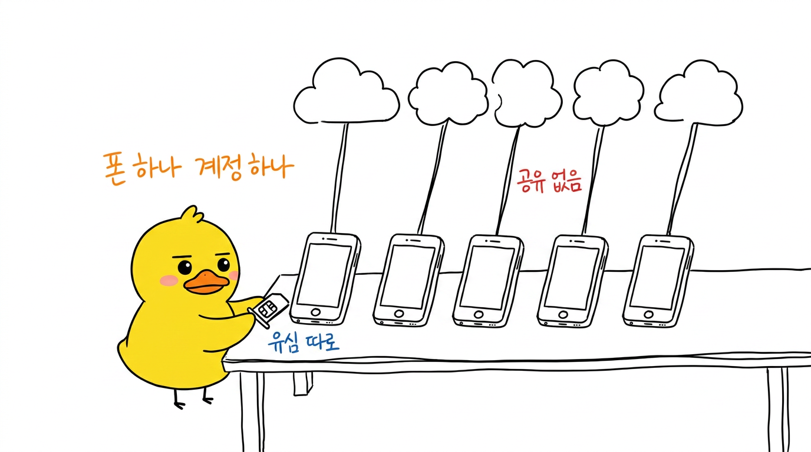

# HypeDuck Illustrations

글·대본·개념을 **흰 배경 손그림 오리 일러스트**로 만들어주는 Claude Code 스킬.
블로그·유튜브·스레드 본문 삽화, PPT용 낱장 이미지에 쓴다.



- 순백 배경 · 검정 세선 손그림 · 여백 35%+
- **오리만 컬러** (노랑 `#FFD400` 몸 + 주황 `#FF8A00` 부리, 레퍼런스 얼굴 고정)
- 한국어 손글씨 주석 (빨강=경고/결과, 주황=흐름, 파랑=상태)
- 장당 메시지 1개 · 16:9 (1376×768)

Claude가 글을 읽고 → 어떤 장면을 그릴지 정하고 → 이미지를 생성하고 → 육안 QA 후 실패 장만 재생성한다.
이미지 생성까지만 한다. PPTX·캐러셀 조립은 범위 밖.

## 요구사항

- Node.js 18+
- [OpenRouter](https://openrouter.ai/keys) API 키 (모델 `google/gemini-3-pro-image` 과금 — 장당 몇 센트)

```bash
export OPENROUTER_API_KEY=sk-or-...
```

`~/.zshrc`에 넣어두면 Claude Code가 알아서 쓴다. env가 없으면 `./.env`, `~/.hypeduck.env`도 찾는다.

## 설치

### 1) 플러그인 (권장)

Claude Code 안에서:

```
/plugin marketplace add hedgehogcandy/hypeduck-illustrations
/plugin install hypeduck-illustrations@hypeduck
```

터미널에서 한 번에:

```bash
claude plugin marketplace add hedgehogcandy/hypeduck-illustrations
claude plugin install hypeduck-illustrations@hypeduck
```

업데이트는 `/plugin marketplace update hypeduck`.

### 2) 스킬만 수동 복사

```bash
git clone https://github.com/hedgehogcandy/hypeduck-illustrations.git
mkdir -p ~/.claude/skills
cp -R hypeduck-illustrations/skills/hypeduck-illustrations ~/.claude/skills/
```

특정 프로젝트에만 쓰려면 `~/.claude/skills` 대신 `<프로젝트>/.claude/skills`.

### 3) MCP는 필요 없다

이건 MCP 서버가 아니라 스킬이다 — Claude Code가 스킬 문서를 읽고 안에 든 `gen.mjs`를 직접 실행하는 구조라 MCP 서버를 띄울 게 없다.
Claude Desktop 등 MCP만 붙는 호스트에서 쓰고 싶으면 아래 CLI로 직접 돌리면 된다.

## 사용

Claude Code에서:

```
/hypeduck-illustrations 이 글로 오리 일러스트 5장 뽑아줘
```

또는 그냥 "이 글에 오리 일러스트 넣어줘" 라고만 해도 스킬이 붙는다.

### CLI 직접 실행

`shots.json`을 쓰고:

```json
{
  "outDir": "/절대/경로/illustrations",
  "shots": [
    {
      "file": "05-aged-account-jar.png",
      "theme": "Warm up an aged account slowly",
      "structure": "Character state",
      "core": "Don't change everything at once — warm it up over two weeks",
      "composition": "The duck sits on a small round stool next to a big glass jar labeled in Korean, lifting the jar's lid with one wing and raising one finger with the other, deadpan. To the right, a row of 14 small hand-drawn calendar boxes runs across the canvas — only the first two are checked.",
      "labels": "red handwritten \"한 번에 바꾸지 않기\" left of the jar / blue handwritten \"묵힌 계정\" on the jar label / orange handwritten \"14일 워밍업\" under the calendar row"
    }
  ]
}
```

```bash
node skills/hypeduck-illustrations/scripts/gen.mjs /절대경로/shots.json
node skills/hypeduck-illustrations/scripts/gen.mjs /절대경로/shots.json 3 5   # 3·5번만 재생성
```

필드 설명과 QA 기준은 [SKILL.md](skills/hypeduck-illustrations/SKILL.md).

## 마스코트 바꾸기

`skills/hypeduck-illustrations/assets/hypeduck-logo.png`를 네 캐릭터 정면 얼굴 PNG로 갈아끼우고,
`scripts/gen.mjs`의 `DNA` 블록에서 색상·생김새 문장을 고치면 다른 IP로도 쓸 수 있다.

## 라이선스

MIT (코드·프롬프트). 오리 마스코트 이미지는 HypeDuck 브랜드 마크 — [LICENSE](LICENSE) 참고.
